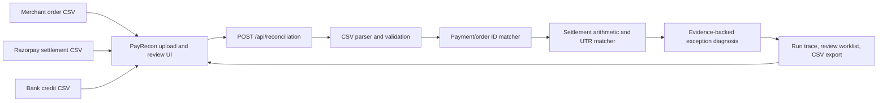

# PayRecon

**PayRecon is an evidence-first payment settlement reconciliation agent.** It helps a merchant finance operator close the gap between three records that describe the same money differently:

1. the merchant’s order/invoice ledger,
2. the Razorpay settlement export, and
3. the bank statement showing settlement credits.

The operator provides three CSVs. PayRecon normalizes their references and amounts, links order rows to gateway payment rows by stable IDs, groups settlement lines, matches settlement credits to the bank by UTR, checks the arithmetic, explains exceptions with row-level evidence, and exports a review worklist. The current build is a working local reconciliation app with synthetic sample data and real CSV upload/processing—not a live Razorpay connection.

## Why this problem

Razorpay provides settlement reports and payment/settlement details for reconciliation. Razorpay documentation describes payment entities mapped to settlements, settlement IDs and UTRs, and settlement reports containing transactions and corresponding settlement IDs. A merchant’s internal order/invoice ledger and its bank statement are separate sources, so finance still needs to connect the gateway view back to its own purchase records and actual bank credits. [Razorpay settlement and reconciliation guide](https://d6xcmfyh68wv8.cloudfront.net/settlement/), [Razorpay dashboard reports](https://razorpay.com/blog/how-to-use-razorpay-dashboard/)

PayRecon’s product hypothesis is that finance teams spend recurring effort investigating mismatches across those three ledgers—missing rows, payout timing, fee/tax/refund arithmetic, and unexplained credits. It does not claim Razorpay’s reports are inadequate or that every merchant has the same problem. Validate the frequency, cost, and ideal workflow with actual Razorpay merchants before making market-wide claims.

**Hackathon wedge:** exception-first cross-ledger reconciliation. The agent does more than display a dashboard: it ingests files, performs a sequence of matching/reconciliation tools, diagnoses exceptions, attaches evidence, recommends a next step, and produces a reviewable export in one run.

## Product users

- **Finance operator / accountant:** Quickly identify what balances, what is pending, and which exceptions need follow-up.
- **Merchant support / operations:** Trace a bank credit, settlement, and payment/order without manually hopping between three exports.
- **Merchant engineering:** Preserve stable purchase and payment IDs across internal orders and gateway exports.
- **Reviewer / finance lead:** Approve or investigate evidence-backed exceptions before a bookkeeping change is made.

Initial target: one online merchant using Razorpay Checkout/Orders with a stable merchant order or purchase reference. Start with one reporting window and one merchant. Marketplace, subscription, multi-gateway, and multi-entity tax coverage are future scope.

## What the agent does end to end

1. **Ingests** three CSV files: merchant orders, Razorpay settlement lines, and bank credits.
2. **Validates and normalizes** CSV headers and rupee amounts into integer paise. Invalid headers, malformed amounts, and unterminated quoted fields fail with a row/source-specific error.
3. **Links payment rows** using exact Razorpay payment ID or merchant purchase reference. It never links records by amount alone.
4. **Checks identity and gross values** and flags conflicting payment IDs, duplicate payment lines, missing payment rows, orphan gateway lines, and gross amount variances.
5. **Checks settlement arithmetic** using `gross − fee − tax − refund/offset = reported net` with a one-paise rounding tolerance.
6. **Groups settlement lines** by UTR (or settlement ID if UTR is absent), sums reported net credits, and matches to bank statements using exact UTR plus amount.
7. **Diagnoses exceptions** with source-row references, amounts and IDs that support the finding, and a suggested review step.
8. **Prepares a worklist and auditor export.** Export includes exact matched rows with UTR and dates, all open/reviewed exceptions, evidence, AI notes/drafts (if generated), and human decisions. A reviewer records a decision (resolved after verification, timing difference, escalation, or not an issue) with a required note. The decision stores reviewer and timestamp, appears in the activity log, and is included in the export. Decisions can be reopened. They are held in the current browser tab session only.
9. **Optional AI assistance.** The Exception Investigator prepares cautious business-cause hypotheses, support-ticket drafts, and candidate bookkeeping entries. The Natural-Language Finance Command translates supported questions into bounded filters; all report filtering and calculations remain local and deterministic.

The agent does not post journal entries, modify the merchant’s books, transfer money, issue refunds, or contact Razorpay or customers. A suggested action is for a human to review. No match is based only on amount, name, or date.

## Current product scope and truth in labeling

- Product name in the UI and package: **PayRecon**. It is not a Razorpay product and does not use Razorpay branding assets.
- The public landing page, local profile-selection sign-in, and reconciliation workspace use a Razorpay-inspired blue, white, and neutral visual system; PayRecon branding remains distinct and uses its own SVG mark and browser icon. The login is a local prototype profile selector, not production authentication, and the two profiles do not enforce real authorization boundaries.
- The reconciliation engine is an **orchestrated deterministic workflow**, not an LLM or trained matching model. Its steps call local parsing/matching/diagnosis code, and arithmetic plus identity matching remain deterministic and explainable. The optional Gemini Exception Investigator receives selected exception context only after an explicit disclosure action. It drafts cause hypotheses, support tickets, and candidate journal entries; it cannot change reconciliation results or perform external actions.
- The workflow is end to end for the three canonical CSV schemas documented below. The parser has basic header aliases, but direct support for every current Razorpay export version is not verified. Use the included templates or adapt the header map after testing against real redacted exports.
- CSV contents are sent from the browser to the local Next.js API for processing. The report is held in page state for the current session; runs are not yet persisted to a database or durable audit log.
- Sample values are synthetic. Exception “value” may overlap between related findings; the UI discloses this.
- There is no live Razorpay API/SDK, real webhook processing, merchant account, bank API, authentication, multi-tenant support, or real-world reconciliation measurement.

## Architecture as implemented



The reconciliation API processes each request in memory and returns a report. Raw uploaded CSVs are not saved. The current report and review decisions are kept in `sessionStorage` so refreshes in the same tab session retain the work; closing the browser session or signing out clears it. There is no durable run history or database yet. Sign-in is a browser session profile selector for the local prototype only; it is not a security boundary. No credentials are required. The UI includes sample data and template download for a reproducible local walkthrough.

### Main source files

- `src/app/page.tsx` — PayRecon public landing page, product explanation, and entry points.
- `src/app/login/page.tsx` — local profile-selection sign-in screen; uses browser session state, not production authentication.
- `src/app/reconciliation/page.tsx` — PayRecon workspace, working source shortcuts and CSV upload cards, sample/upload runs, help and account menus, agent trace, summary, matched lines, exception search/filter, reviewer decision dialog/activity, session restore, reset, templates, and CSV export.
- `src/app/icon.svg` — original PayRecon browser icon; the header and sign-in use the same custom mark.
- `src/app/payrecon.css` — PayRecon visual system and responsive layouts.
- `src/app/globals.css` — shared font and baseline styles.
- `src/app/layout.tsx` — page shell and PayRecon metadata.
- `src/lib/reconciliation.ts` — CSV parser, demo ledgers, input normalizers, deterministic matching, settlement/bank reconciliation, exception diagnosis, and agent-step report.
- `src/app/api/reconciliation/route.ts` — POST route; validates payload and file size, invokes workflow, returns report/error.
- `AGENTS.md` — Next.js-generated rules plus project handoff pointer.
- `skills.md` — detailed instructions for any coding agent continuing this project.

## Reconciliation rules and exceptions

### Matching keys

Priority is exact Razorpay `payment_id` when present, otherwise exact merchant `purchase_ref`/order reference. Settlement-to-bank grouping uses exact UTR. If no UTR is present, the report can group by settlement ID but does not claim a bank match. Amount-only matches are expressly prohibited because duplicate amounts are common and do not establish identity.

### Current findings

| Finding | Meaning | Typical review step |
| --- | --- | --- |
| `missing_payment` | Merchant order has no gateway settlement row matched by ID/reference | Check payment state and report date range/provider dashboard |
| `unmapped_gateway_payment` | Gateway row has no merchant order match | Check purchase-reference mapping and period before linking |
| `amount_variance` | Gross values, IDs, duplicates, or settlement/bank amounts conflict | Inspect the cited source rows; do not auto-correct |
| `settlement_math` | Gross less fee/tax/refund does not equal reported net | Inspect line and any separate adjustment |
| `missing_bank_credit` | Settlement UTR has no exact bank statement row | Check bank date range and settlement timing; escalate if overdue |
| `bank_unmatched` | Bank credit UTR is absent from the uploaded settlement report | Check for a settlement outside the period or non-Razorpay credit |

High severity means an ID/amount conflict or likely double counting needs review; medium indicates a missing record or settlement arithmetic issue; low is an unmatched bank credit that may be outside the export period. These are prioritization labels, not financial advice or proof of loss.

### Agent trace

Each successful run returns six completed steps: `load_source_files`, `normalize_currency_and_keys`, `match_payment_id_or_purchase_ref`, `group_settlement_and_match_utr`, `classify_variance_and_attach_rows`, and `draft_exception_worklist`. The trace is generated by the actual workflow results, not an LLM narration. It reports counts and describes the tools executed. The exception worklist is a draft; all exceptions remain subject to finance review.

## CSV schemas

All amount columns accepted by the canonical template are **rupees**, converted to integer paise. Do not give this demo paise values in a rupee column. Each uploaded file must have a header and at least one data row. UTF-8 BOM, quoted commas, escaped quotes, and multiline quoted CSV fields are supported.

### Merchant order ledger

Required columns (one reference header and one amount header):

```csv
purchase_ref,payment_id,amount_rupees,created_at
ORD-6001,pay_A100,12000.00,2026-09-29T10:02:00Z
```

Recognized reference aliases include `purchase_ref`, `merchant_order_id`, `order_reference`, `receipt`, and `order_id`. Payment ID is optional; aliases include `payment_id`, `razorpay_payment_id`, and `pay_id`. Amount aliases include `amount_rupees`, `gross_amount_rupees`, `order_amount_rupees`, `amount`, and `gross_amount`.

### Razorpay settlement export

Each row represents a settlement/payment line. Must include `payment_id` or `purchase_ref`, gross amount, and net amount. Fee, tax, refund/offset, settlement ID, and UTR are supported.

```csv
payment_id,purchase_ref,settlement_id,utr,gross_amount_rupees,fee_rupees,tax_rupees,refund_rupees,net_amount_rupees,settled_at
pay_A100,ORD-6001,setl_001,UTR-884201,12000.00,240.00,43.20,0,11716.80,2026-09-29T20:00:00Z
```

Aliases include `settlement_id`/`entity_id`, `utr`/`utr_number`/`bank_reference`, `gross_amount_rupees`/`payment_amount_rupees`/`gross_amount`/`amount`, fee/tax/refund names, and `net_amount_rupees`/`settled_amount`/`settlement_amount`. Optional `settled_at`/`settlement_date`/`settled_date` values let the operator investigate payout timing.

### Bank statement

Upload credit rows for the matching period. Each row needs a UTR/reference or narration and a credit/deposit amount.

```csv
utr,description,credit_rupees,transaction_date
UTR-884201,RAZORPAY SETTLEMENT setl_001,11716.80,2026-09-30
```

Recognized reference aliases include `utr`, `utr_number`, `bank_reference`, `reference`, and `transaction_reference`; descriptions include `description`, `narration`, `particulars`, and `remarks`; credit aliases include `credit_rupees`, `deposit_rupees`, `credit`, `deposit`, `credit_amount_rupees`, and `credit_amount`. Debit-only rows are excluded. If a file only has a generic amount column, include a transaction-type or debit/credit column so PayRecon can determine whether the row is an incoming credit. It rejects ambiguous generic amount-only statements rather than treating debits as payouts. Optional `transaction_date`/`value_date`/`posted_at`/`date` is paired with the gateway settlement date for delay analysis; if either timestamp is absent, PayRecon does not infer a delay.

Download all three empty templates from the app’s **Download CSV templates** button. The “Run sample” button uses 134 generated source records: 60 merchant orders, 60 gateway rows, and 14 bank rows. It includes grouped payouts, three checkout drop-offs, three unmapped gateway rows, three unreferenced bank credits, a gross conflict, a settlement arithmetic discrepancy, a one-paisa accepted rounding edge, two Friday-to-Monday settlement lags, one bank amount variance, and one payout outside the bank window. The benchmark expects 56 exact clean pairs and 13 finding rows. It reports clean-match precision/recall and exception precision/recall against labels generated alongside this fixture. These are not independent model metrics, real-merchant evidence, or proof of production accuracy.

## Local setup and use

Requirements: Node.js 20.9 or newer and npm.

```bash
npm install
npm run dev
```

Open [http://localhost:3000](http://localhost:3000), choose **Open local workspace**, select a local team profile, then choose **Run sample** to inspect a complete workflow or add all three CSVs and select **Run reconciliation**. Review the ledger bridge and agent trace, inspect findings in the exception worklist, record a decision with a note, and export the CSV. Review decisions survive a same-tab refresh but remain local session state and do not alter source data. The profile switch changes the displayed local role; it is not an authorization control.

Optional AI features use Gemini 3.8 Flash at low thinking level. To enable them, add `GEMINI_API_KEY=your_key` to a local `.env.local` file and restart the Next.js server. Exception investigation opens a per-request disclosure and sends selected exception category, severity, explanation, row evidence, amount in paise, available payment/order/settlement/UTR identifiers, and related settlement/bank timestamps; it excludes the original CSV files, unrelated ledger rows, merchant profile/name, customer information, and bank narration. It returns cause hypotheses plus support-ticket and candidate journal drafts. A local validator requires supplied identifiers and the exact integer paise amount in the ticket, limits journal accounts to a small allow-list, and requires a proposed journal amount to equal the deterministic finding amount. Journal output is unposted and needs accountant review. The natural-language finance command sends only the operator’s entered query to Gemini for mapping to bounded report filters; all filtering and fee totals are calculated locally. Without a key, supported example queries use a small local rule parser. Never commit `.env.local` or expose the key in client code.

Commands:

```bash
npm run dev     # local development server
npm run lint    # ESLint
npm test        # deterministic reconciliation regression tests
npm run build   # production build
npm run start   # serve a production build
```

## API

### `POST /api/reconciliation`

For sample data:

```json
{ "sample": true }
```

For uploads, send JSON containing three CSV strings and optional source names:

```json
{
  "ordersCsv": "purchase_ref,payment_id,amount_rupees\\nORD-1,pay_1,100.00",
  "settlementsCsv": "payment_id,purchase_ref,settlement_id,utr,gross_amount_rupees,net_amount_rupees\\npay_1,ORD-1,setl_1,UTR-1,100.00,97.64",
  "bankCsv": "utr,description,credit_rupees\\nUTR-1,RAZORPAY,97.64",
  "sourceNames": { "orders": "orders.csv", "settlements": "settlement.csv", "bank": "bank.csv" }
}
```

Successful response includes `generatedAt`, `mode`, source names, summary counts, six workflow steps, findings with evidence/recommended action, and exact matched rows. A sample-mode response also includes `benchmark`, which measures results against labels built into its own known-answer synthetic fixture. Uploaded batches do not claim accuracy without external ground truth. Bad CSV or missing columns return HTTP 400 with an error; each source is limited to 2 MB of text. This endpoint has no authentication and is intended for local use only.

## Security and privacy boundaries

- This is a local single-user tool. It has no authentication, authorization, merchant tenancy, CSRF protection, or production deployment hardening. Do not expose it publicly.
- Uploaded files are sent to the local app server for processing. The current route does not save them, but a hosted deployment would transmit merchant financial records to that server; do not host it with real records until access, retention, privacy, and security controls are designed.
- Use synthetic or properly redacted data for the demo. Do not upload card PAN/CVV, bank login data, UPI PIN, gateway secrets, or unnecessary customer personal data.
- All outputs are suggestions/workpapers. A human finance operator must review them before accounting/posting action.
- The optional Gemini investigator receives the exception details described above only after the operator confirms the disclosure dialog. Gemini output is structured and locally validated; it cannot calculate balances, change findings, post a journal, or send a ticket. The finance command translates questions into bounded categories/severity/amount/delay filters; the UI computes the result. The live provider paths remain unverified until a local API key is configured. Use synthetic data until the privacy/data-flow scope is reviewed for a real merchant.

## Delivery phases

1. **Problem and product framing — implemented, validation pending:** PayRecon targets exception-first reconciliation across merchant orders, Razorpay settlement lines, and bank credits. The recurring manual pain is a product hypothesis to validate with finance operators.
2. **Local end-to-end workflow — implemented and browser-verified:** CSV ingestion, normalization, exact-ID matching, settlement/UTR reconciliation, evidence-backed findings, trace, and export run locally. A populated three-file upload was run through the browser on 2026-10-02.
3. **Operator interface — implemented and browser-verified:** Public landing page, local profile-selection sign-in, responsive Razorpay-inspired workspace, original brand mark and browser icon, role/profile switcher, protected workspace entry, working tabs and actions, required outcome/note review dialog, reviewer decision/reopen history, session restore, and CSV export. Desktop and 390px mobile widths were inspected.
4. **Matching safeguards and batch evaluation — core paths implemented; broader validation pending:** Duplicate bank UTRs, repeated gateway payment IDs, conflicting order/payment identifiers, and duplicate merchant IDs are treated as ambiguous; incomplete fee/tax/refund data does not get treated as zero; explicit bank credits are used and debit-only rows are excluded; generic amount-only statements are rejected. Seventeen regression tests pass, including source-row evidence, AI draft bounds, command filters, dated payout delays, and a 5,000-order/1,000-payout synthetic smoke batch. The app-level 2 MB-per-source limit, template downloads, malformed amount feedback, and rerunning another uploaded batch were also verified. The new sample contains 134 records and 13 seeded finding rows. Its known-answer metrics are fixture checks, not independent evidence or a sustained load test. Test additional bank formats, periods, currencies, reversals, partial settlements, and native exports before claiming broad compatibility.
5. **AI Exception Investigator and finance command — implemented; live provider verification pending:** the operator can request cause hypotheses, support-ticket drafts, and journal candidates for up to 50 findings; or ask natural-language questions that map to bounded local report filters. The investigator’s data-use disclosure lists the exact fields sent; the command sends only entered query text. No source files are sent. Output constraints and identifiers/journal amounts are validated, while calculations, matching, filtering, and decisions remain deterministic/human-owned. No Gemini API key is configured in this workspace, so live output quality is unverified.
6. **Persistence, integrations, production security — not implemented:** no durable run history, Razorpay/bank connector, authentication, tenant isolation, or accounting posting. Define access and retention controls before handling real merchant data in a hosted service.
7. **Merchant validation/pilot — not started:** interview operators, obtain redacted exports, shadow-review findings, measure exception quality/time-to-close, and run a consented pilot before making outcome claims.

## Buildathon readiness assessment

Razorpay's published AI Buildathon brief for **AI Finance Controller** calls for a finance-operations loop over 50+ synthetic records, with match rate and unresolved exceptions; its stated bar is throughput, measured accuracy, and an honest exception list. It also describes evaluation around problem taste, build quality, AI judgment, and failure recovery. PayRecon now demonstrates the batch size, a known-answer fixture, explicit exceptions, and guarded failure cases. The fixture is self-authored and cannot establish real-world accuracy. [Razorpay AI Buildathon brief](https://razorpay.com/buildathon/)

**This is not a guaranteed selection or full-score claim.** The build now demonstrates deterministic reconciliation over 60 orders and 134 source records, 13 seeded findings, dates for weekend payout lags, bounded AI investigation, natural-language filter translation, and a reviewable auditor workpaper. This is a self-authored synthetic benchmark. Gemini is not configured here, so the AI outputs have been validated only with schema/logic tests—not with live model responses. PayRecon still lacks redacted merchant-export validation, an independently labeled holdout set, measured operator time saved, and proof of differentiation from existing reconciliation products.

1. Validate the exact reconciliation pain and differentiator with finance operators, then narrow the pitch to a specific recurring exception they cannot handle efficiently today.
2. Test against representative, redacted exports and an independently labeled holdout set; publish false-positive and false-negative counts, not only the generated fixture benchmark.
3. Configure the local Gemini API key and evaluate investigation usefulness, ticket identifier fidelity, and journal safety on labeled synthetic cases. Review the exact field disclosure before any real-merchant data is used.
4. Capture a complete failure-and-recovery demo: malformed source, ambiguous duplicate UTR, correction/re-upload, human review, reopen, and final export. Report throughput on realistic batch sizes before making speed or scale claims.
5. Package a public repository, a short end-to-end pitch, architecture/data-flow diagram, and a candid “what broke and how it was fixed” story if submitting to a buildathon.

The product is currently best described as an **auditable reconciliation workflow with bounded optional AI investigation, finance-query translation, and synthetic evaluation**. AI quality and merchant benefit still need live provider and independent evaluation.

## Future roadmap

1. Test with redacted real merchant exports and adjust canonical mappings based on observed formats—not guessed columns.
2. Extend the regression suite with source-row evidence assertions, malformed JSON/incomplete API requests, additional real-world fee/tax/refund conventions, out-of-window rows, and an independently labeled holdout set when available.
3. Improve exception explanations and review lifecycle; persist run ID, source-file hash/metadata (not full files by default), decisions, reviewer, and export history behind authentication.
4. Add merchant/provider connectors only with credentials, API limits, reconciliation semantics, webhook/API verification, and secure secret handling.
5. Measure time saved and reviewed exception quality with a merchant before claiming ROI. Keep any future model separate from deterministic accounting arithmetic and evaluate against a safe baseline.

## Sources and product evidence

- [Razorpay settlement and reconciliation guide](https://d6xcmfyh68wv8.cloudfront.net/settlement/) — settlement status, settlement report, payment-to-settlement entity link, and UTR explanation.
- [Razorpay dashboard guide](https://razorpay.com/blog/how-to-use-razorpay-dashboard/) — settlement detail and downloadable daily/monthly settlement reports.
- [Razorpay settlements dashboard actions](https://razorpay.com/docs/payments/settlements/dashboard/) — settlement dashboard/report context.

These sources establish that Razorpay provides settlement visibility and reports. The cross-ledger exception workflow is PayRecon’s product hypothesis; merchant interviews and usage data are still needed to establish frequency, value, and differentiation.
