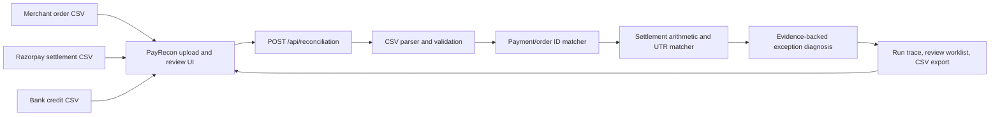

# PayRecon

**PayRecon is an evidence-first payment settlement reconciliation agent.** It helps a merchant finance operator close the gap between three records that describe the same money differently:

1. the merchant’s order/invoice ledger,
2. the Razorpay settlement export, and
3. the bank statement showing settlement credits.

The operator provides three CSVs. PayRecon normalizes their references and amounts, links order rows to gateway payment rows by stable IDs, groups settlement lines, matches settlement credits to the bank by UTR, checks the arithmetic, explains exceptions with row-level evidence, and exports a review worklist. The current build is a working local reconciliation app with synthetic sample data and real CSV upload/processing—not a live Razorpay connection.

## Why this problem

Razorpay provides settlement reports and payment/settlement details for reconciliation. Razorpay documentation describes payment entities mapped to settlements, settlement IDs and UTRs, and settlement reports containing transactions and corresponding settlement IDs. A merchant’s internal order/invoice ledger and its bank statement are separate sources, so finance still needs to connect the gateway view back to its own purchase records and actual bank credits. [Razorpay settlement and reconciliation guide](https://d6xcmfyh68wv8.cloudfront.net/settlement/), [Razorpay dashboard reports](https://razorpay.com/blog/how-to-use-razorpay-dashboard/)

PayRecon’s product hypothesis is that finance teams spend recurring effort investigating mismatches across those three ledgers—missing rows, payout timing, fee/tax/refund arithmetic, and unexplained credits. It does not claim Razorpay’s reports are inadequate or that every merchant has the same problem. Validate the frequency, cost, and ideal workflow with actual Razorpay merchants before making market-wide claims.

**Hackathon wedge:** exception-first cross-ledger reconciliation. The agent does more than display a dashboard: it ingests files, performs a sequence of matching/reconciliation tools, diagnoses exceptions, attaches evidence, recommends a next step, and produces a reviewable export in one run.

## Product users

- **Finance operator / accountant:** Quickly identify what balances, what is pending, and which exceptions need follow-up.
- **Merchant support / operations:** Trace a bank credit, settlement, and payment/order without manually hopping between three exports.
- **Merchant engineering:** Preserve stable purchase and payment IDs across internal orders and gateway exports.
- **Reviewer / finance lead:** Approve or investigate evidence-backed exceptions before a bookkeeping change is made.

Initial target: one online merchant using Razorpay Checkout/Orders with a stable merchant order or purchase reference. Start with one reporting window and one merchant. Marketplace, subscription, multi-gateway, and multi-entity tax coverage are future scope.

## What the agent does end to end

1. **Ingests** three CSV files: merchant orders, Razorpay settlement lines, and bank credits.
2. **Validates and normalizes** CSV headers and rupee amounts into integer paise. Invalid headers, malformed amounts, and unterminated quoted fields fail with a row/source-specific error.
3. **Links payment rows** using exact Razorpay payment ID or merchant purchase reference. It never links records by amount alone.
4. **Checks identity and gross values** and flags conflicting payment IDs, duplicate payment lines, missing payment rows, orphan gateway lines, and gross amount variances.
5. **Checks settlement arithmetic** using `gross − fee − tax − refund/offset = reported net` with a one-paise rounding tolerance.
6. **Groups settlement lines** by UTR (or settlement ID if UTR is absent), sums reported net credits, and matches to bank statements using exact UTR plus amount.
7. **Diagnoses exceptions** with source-row references, amounts and IDs that support the finding, and a suggested review step.
8. **Prepares a worklist** and provides a downloadable exception CSV. A user can mark findings reviewed in the current browser session.

The agent does not post journal entries, modify the merchant’s books, transfer money, issue refunds, or contact Razorpay or customers. A suggested action is for a human to review. No match is based only on amount, name, or date.

## Current product scope and truth in labeling

- Product name in the UI and package: **PayRecon**. It is not a Razorpay product and does not use Razorpay branding assets.
- The operator dashboard uses a Razorpay-inspired blue, white, and neutral visual system; PayRecon branding remains distinct.
- The current agent is an **orchestrated deterministic workflow**, not an LLM or trained reconciliation model. Each step calls local parsing/matching/diagnosis code. Arithmetic and identity matching are deterministic and explainable.
- The workflow is end to end for the three canonical CSV schemas documented below. The parser has basic header aliases, but direct support for every current Razorpay export version is not verified. Use the included templates or adapt the header map after testing against real redacted exports.
- CSV contents are sent from the browser to the local Next.js API for processing. The report is held in page state for the current session; runs are not yet persisted to a database or durable audit log.
- Sample values are synthetic. Exception “value” may overlap between related findings; the UI discloses this.
- There is no live Razorpay API/SDK, real webhook processing, merchant account, bank API, authentication, multi-tenant support, or real-world reconciliation measurement.

## Architecture as implemented



The current run is stateless: the route processes the request and returns a report. It does not persist the uploaded files or report. No credentials are required. The UI includes sample data and template download for a reproducible local walkthrough.

### Main source files

- `src/app/page.tsx` — PayRecon workspace, working source shortcuts and CSV upload cards, sample/upload runs, help and account menus, agent trace, summary, matched lines, exception search/filter/review, reset, templates, and CSV export.
- `src/app/payrecon.css` — PayRecon visual system and responsive layouts.
- `src/app/globals.css` — shared font and baseline styles.
- `src/app/layout.tsx` — page shell and PayRecon metadata.
- `src/lib/reconciliation.ts` — CSV parser, demo ledgers, input normalizers, deterministic matching, settlement/bank reconciliation, exception diagnosis, and agent-step report.
- `src/app/api/reconciliation/route.ts` — POST route; validates payload and file size, invokes workflow, returns report/error.
- `AGENTS.md` — Next.js-generated rules plus project handoff pointer.
- `skills.md` — detailed instructions for any coding agent continuing this project.

## Reconciliation rules and exceptions

### Matching keys

Priority is exact Razorpay `payment_id` when present, otherwise exact merchant `purchase_ref`/order reference. Settlement-to-bank grouping uses exact UTR. If no UTR is present, the report can group by settlement ID but does not claim a bank match. Amount-only matches are expressly prohibited because duplicate amounts are common and do not establish identity.

### Current findings

| Finding | Meaning | Typical review step |
| --- | --- | --- |
| `missing_payment` | Merchant order has no gateway settlement row matched by ID/reference | Check payment state and report date range/provider dashboard |
| `unmapped_gateway_payment` | Gateway row has no merchant order match | Check purchase-reference mapping and period before linking |
| `amount_variance` | Gross values, IDs, duplicates, or settlement/bank amounts conflict | Inspect the cited source rows; do not auto-correct |
| `settlement_math` | Gross less fee/tax/refund does not equal reported net | Inspect line and any separate adjustment |
| `missing_bank_credit` | Settlement UTR has no exact bank statement row | Check bank date range and settlement timing; escalate if overdue |
| `bank_unmatched` | Bank credit UTR is absent from the uploaded settlement report | Check for a settlement outside the period or non-Razorpay credit |

High severity means an ID/amount conflict or likely double counting needs review; medium indicates a missing record or settlement arithmetic issue; low is an unmatched bank credit that may be outside the export period. These are prioritization labels, not financial advice or proof of loss.

### Agent trace

Each successful run returns six completed steps: `load_source_files`, `normalize_currency_and_keys`, `match_payment_id_or_purchase_ref`, `group_settlement_and_match_utr`, `classify_variance_and_attach_rows`, and `draft_exception_worklist`. The trace is generated by the actual workflow results, not an LLM narration. It reports counts and describes the tools executed. The exception worklist is a draft; all exceptions remain subject to finance review.

## CSV schemas

All amount columns accepted by the canonical template are **rupees**, converted to integer paise. Do not give this demo paise values in a rupee column. Each uploaded file must have a header and at least one data row. UTF-8 BOM, quoted commas, escaped quotes, and multiline quoted CSV fields are supported.

### Merchant order ledger

Required columns (one reference header and one amount header):

```csv
purchase_ref,payment_id,amount_rupees,created_at
ORD-6001,pay_A100,12000.00,2026-09-29T10:02:00Z
```

Recognized reference aliases include `purchase_ref`, `merchant_order_id`, `order_reference`, `receipt`, and `order_id`. Payment ID is optional; aliases include `payment_id`, `razorpay_payment_id`, and `pay_id`. Amount aliases include `amount_rupees`, `gross_amount_rupees`, `order_amount_rupees`, `amount`, and `gross_amount`.

### Razorpay settlement export

Each row represents a settlement/payment line. Must include `payment_id` or `purchase_ref`, gross amount, and net amount. Fee, tax, refund/offset, settlement ID, and UTR are supported.

```csv
payment_id,purchase_ref,settlement_id,utr,gross_amount_rupees,fee_rupees,tax_rupees,refund_rupees,net_amount_rupees
pay_A100,ORD-6001,setl_001,UTR-884201,12000.00,240.00,43.20,0,11716.80
```

Aliases include `settlement_id`/`entity_id`, `utr`/`utr_number`/`bank_reference`, `gross_amount_rupees`/`payment_amount_rupees`/`gross_amount`/`amount`, fee/tax/refund names, and `net_amount_rupees`/`settled_amount`/`settlement_amount`.

### Bank statement

Upload credit rows for the matching period. Each row needs a UTR/reference or narration and a credit/deposit amount.

```csv
utr,description,credit_rupees,transaction_date
UTR-884201,RAZORPAY SETTLEMENT setl_001,11716.80,2026-09-30
```

Recognized reference aliases include `utr`, `utr_number`, `bank_reference`, `reference`, and `transaction_reference`; descriptions include `description`, `narration`, `particulars`, and `remarks`; amount aliases include `credit_rupees`, `deposit_rupees`, `credit`, `deposit`, `amount_rupees`, and `amount`.

Download all three empty templates from the app’s **Download CSV templates** button. The “Run sample” button uses built-in synthetic data with a reconciled batch, a net arithmetic discrepancy, an order missing from the gateway export, a settlement with no bank credit, an orphan gateway payment, and an unrelated bank credit.

## Local setup and use

Requirements: Node.js 20.9 or newer and npm.

```bash
npm install
npm run dev
```

Open [http://localhost:3000](http://localhost:3000), choose **Run sample** to inspect a complete workflow, or add all three CSVs and select **Run reconciliation**. Review the ledger bridge and agent trace, inspect findings in the exception worklist, mark findings reviewed, and export the CSV. “Reviewed” marks are browser-session-only and do not alter source data.

Commands:

```bash
npm run dev     # local development server
npm run lint    # ESLint
npm run build   # production build
npm run start   # serve a production build
```

## API

### `POST /api/reconciliation`

For sample data:

```json
{ "sample": true }
```

For uploads, send JSON containing three CSV strings and optional source names:

```json
{
  "ordersCsv": "purchase_ref,payment_id,amount_rupees\\nORD-1,pay_1,100.00",
  "settlementsCsv": "payment_id,purchase_ref,settlement_id,utr,gross_amount_rupees,net_amount_rupees\\npay_1,ORD-1,setl_1,UTR-1,100.00,97.64",
  "bankCsv": "utr,description,credit_rupees\\nUTR-1,RAZORPAY,97.64",
  "sourceNames": { "orders": "orders.csv", "settlements": "settlement.csv", "bank": "bank.csv" }
}
```

Successful response includes `generatedAt`, `mode`, source names, summary counts, six workflow steps, findings with evidence/recommended action, and exact matched rows. Bad CSV or missing columns return HTTP 400 with an error; each source is limited to 2 MB of text. This endpoint has no authentication and is intended for local demo use only.

## Security and privacy boundaries

- This is a local single-user tool. It has no authentication, authorization, merchant tenancy, CSRF protection, or production deployment hardening. Do not expose it publicly.
- Uploaded files are sent to the local app server for processing. The current route does not save them, but a hosted deployment would transmit merchant financial records to that server; do not host it with real records until access, retention, privacy, and security controls are designed.
- Use synthetic or properly redacted data for the demo. Do not upload card PAN/CVV, bank login data, UPI PIN, gateway secrets, or unnecessary customer personal data.
- All outputs are suggestions/workpapers. A human finance operator must review them before accounting/posting action.
- No AI model receives the uploaded data in the current build. Do not add an external model call without explicit configuration, data minimization, and documented privacy behavior.

## Delivery phases

1. **Problem and product framing — implemented, validation pending:** PayRecon targets exception-first reconciliation across merchant orders, Razorpay settlement lines, and bank credits. The recurring manual pain is a product hypothesis to validate with finance operators.
2. **Local end-to-end workflow — implemented and browser-verified:** CSV ingestion, normalization, exact-ID matching, settlement/UTR reconciliation, evidence-backed findings, trace, and export run locally. A populated three-file upload was run through the browser on 2026-10-02.
3. **Operator interface — redesigned and browser-verified at desktop width:** Razorpay-inspired palette and legible typography; working source upload shortcuts, sample/upload runs, help, session menu/reset, summaries, workflow trace, exception search/filter/review, and export. Mobile and deeper accessibility review remain open.
4. **Matching safeguards — core cases implemented; broader validation pending:** duplicate bank UTRs and duplicate merchant IDs are treated as ambiguous; incomplete fee/tax/refund data does not get treated as zero. Test additional bank debit/credit formats, reporting windows, currencies, reversals, partial settlements, and native exports before claiming broad compatibility.
5. **Optional AI assistance — not implemented:** deterministic calculations and identity matching remain authoritative. A future model may only summarize computed findings or prioritize a constrained review queue, with cited evidence and deterministic fallback.
6. **Persistence, integrations, production security — not implemented:** no durable run history, Razorpay/bank connector, authentication, tenant isolation, or accounting posting. Define access and retention controls before handling real merchant data in a hosted service.
7. **Merchant validation/pilot — not started:** interview operators, obtain redacted exports, shadow-review findings, measure exception quality/time-to-close, and run a consented pilot before making outcome claims.

## Future roadmap

1. Test with redacted real merchant exports and adjust canonical mappings based on observed formats—not guessed columns.
2. Add unit/integration tests covering duplicate IDs/UTRs, multiple payments per settlement, fees/tax/refunds/adjustments, rounding, missing/out-of-window rows, malformed CSV, and false-positive risks.
3. Improve exception explanations and review lifecycle; persist run ID, source-file hash/metadata (not full files by default), decisions, reviewer, and export history behind authentication.
4. Add merchant/provider connectors only with credentials, API limits, reconciliation semantics, webhook/API verification, and secure secret handling.
5. Measure time saved and reviewed exception quality with a merchant before claiming ROI. Keep any future model separate from deterministic accounting arithmetic and evaluate against a safe baseline.

## Sources and product evidence

- [Razorpay settlement and reconciliation guide](https://d6xcmfyh68wv8.cloudfront.net/settlement/) — settlement status, settlement report, payment-to-settlement entity link, and UTR explanation.
- [Razorpay dashboard guide](https://razorpay.com/blog/how-to-use-razorpay-dashboard/) — settlement detail and downloadable daily/monthly settlement reports.
- [Razorpay settlements dashboard actions](https://razorpay.com/docs/payments/settlements/dashboard/) — settlement dashboard/report context.

These sources establish that Razorpay provides settlement visibility and reports. The cross-ledger exception workflow is PayRecon’s product hypothesis; merchant interviews and usage data are still needed to establish frequency, value, and differentiation.
